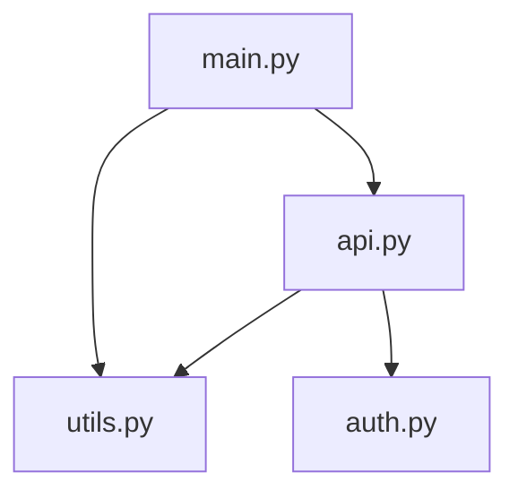

# 依赖关系映射器

## 任务目标
- 本 Skill 用于：Python 项目依赖关系分析与可视化
- 能力包含：依赖关系解析、循环依赖检测、依赖图生成、可视化输出
- 触发条件：用户请求"分析项目依赖"、"查找循环依赖"、"生成依赖图"

## 前置准备
- 依赖说明：仅使用 Python 标准库，无需额外安装
- 当前工作目录应包含 Python 项目代码

## 操作步骤

### 流程 A：分析依赖关系

**步骤1：解析依赖关系**
```bash
python scripts/dependency_parser.py --path ./myproject
```

**步骤2：检测循环依赖**
```bash
python scripts/cycle_detector.py --dependency-data dependencies.json
```

**步骤3：生成依赖图**
```bash
python scripts/graph_generator.py --dependency-data dependencies.json --format mermaid
```

### 流程 B：快速分析

**一键分析**：
```bash
# 解析 + 检测循环 + 生成图
python scripts/dependency_parser.py --path ./myproject > deps.json
python scripts/cycle_detector.py --dependency-data deps.json
python scripts/graph_generator.py --dependency-data deps.json --output dependency.md
```

## 资源索引
- 依赖解析脚本：[scripts/dependency_parser.py](scripts/dependency_parser.py)（解析 import 语句）
- 循环检测脚本：[scripts/cycle_detector.py](scripts/cycle_detector.py)（检测循环依赖）
- 图生成脚本：[scripts/graph_generator.py](scripts/graph_generator.py)（生成 Mermaid/Graphviz）
- 依赖模式参考：[references/dependency-patterns.md](references/dependency-patterns.md)（依赖模式说明）

## 注意事项
- 仅分析 Python 标准库和项目内部模块
- 排除虚拟环境和第三方库目录（venv、node_modules 等）
- 大型项目分析可能耗时较长
- 循环依赖可能导致程序错误，应优先解决

## 使用示例

### 示例1：分析项目依赖
**用户请求**："分析这个项目的依赖关系"

**执行步骤**：
```bash
# 1. 解析依赖
python scripts/dependency_parser.py --path ./myproject --exclude venv,tests

# 2. 输出示例
{
  "myproject/main.py": ["os", "sys", "myproject.utils"],
  "myproject/utils.py": ["json", "datetime"],
  "myproject/api.py": ["myproject.utils", "myproject.auth"]
}
```

### 示例2：检测循环依赖
**用户请求**："检查是否有循环依赖"

**执行步骤**：
```bash
python scripts/cycle_detector.py --dependency-data dependencies.json
```

**输出示例**：
```json
{
  "has_cycles": true,
  "cycles": [
    ["myproject.api", "myproject.auth", "myproject.api"]
  ],
  "message": "发现 1 个循环依赖"
}
```

### 示例3：生成依赖图
**用户请求**："生成依赖关系图"

**执行步骤**：
```bash
python scripts/graph_generator.py --dependency-data deps.json --format mermaid
```

**输出示例**：


## 依赖模式最佳实践

### 避免循环依赖
- **问题**：A → B → A
- **解决**：提取公共模块到 C，改为 A → C ← B

### 分层架构
```
展示层 (UI)
    ↓
业务逻辑层 (Service)
    ↓
数据访问层 (DAO)
    ↓
数据层 (Model)
```

### 依赖注入
- 使用接口而非具体实现
- 通过参数传递依赖
- 便于测试和替换

详见 [references/dependency-patterns.md](references/dependency-patterns.md)
